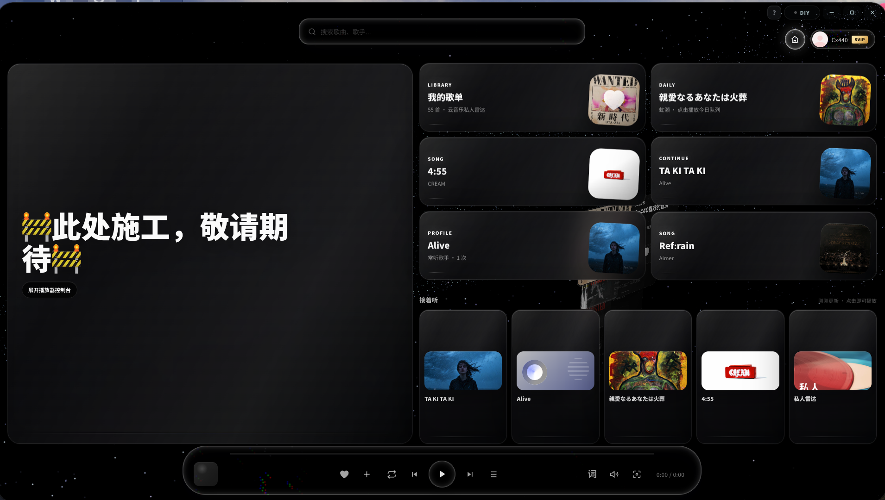

# Mineradio — macOS（非官方 fork / unofficial fork）

> **非官方 macOS 适配版 · Unofficial macOS fork.**
> 本仓库是对 [XxHuberrr/Mineradio](https://github.com/XxHuberrr/Mineradio)（GPL-3.0）的**非官方 macOS 适配 fork**，由 lhysilicon 自 2026-06 起为 macOS 修改与维护，**与原作者无隶属、未经其背书**。原项目、`Mineradio` 名称与 MR Logo 归原作者 XxHuberrr 所有。
> This is an **unofficial macOS fork** of [XxHuberrr/Mineradio](https://github.com/XxHuberrr/Mineradio) (GPL-3.0), modified for macOS by lhysilicon since 2026-06. **Not affiliated with, nor endorsed by, the original author.** The original work, the *Mineradio* name and the MR logo belong to the original author.



Mineradio 是一款沉浸式音乐播放器，把搜索播放、歌词舞台、粒子视觉和 3D 歌单架组合成一个更接近现场感的私人音乐空间。本 fork 在保留全部原功能的前提下，把它适配到 **macOS（Apple Silicon）** 并修复了若干仅在 mac 上出现的问题。

## 与原项目的区别（本 fork 的修改）

本 fork 只做 macOS 适配与缺陷修复，不改动与平台无关的业务逻辑。完整逐条改动见 [CHANGELOG.md](./CHANGELOG.md) 的「macOS fork」节，概要：

- 修复 mac 上 WebGL（ANGLE d3d11）导致的启动黑屏卡死；
- 修复 mac 上 beatmap 缓存默认写死 Windows `D:\` 路径的问题；
- 修复 mac 上关闭窗口后从 Dock 重开导致空白窗口的问题；
- 动态壁纸、桌面歌词鼠标穿透等 Windows 专属机制在 mac 上安全降级（不再产生异常窗口），其余功能保留；
- 增加 macOS 原生应用菜单（保留搜索/登录框的 Cmd+C/V/X/A，并去掉会中途重载播放态的 Cmd+R）；
- 新增 macOS 原生「桌面壁纸模式」：把可视化器沉到桌面当动态壁纸，并配一个常驻、不抢焦点的迷你控制条随时操控（用法见下文「桌面壁纸模式」）；
- 增加 macOS 打包（`build:mac` → `.dmg`/`.app`）与中性图标。

## 安装（macOS）

- **下载安装包**：在本仓库 [Releases](https://github.com/lhysilicon/Mineradio-macOS/releases) 下载 `Mineradio-<版本>-arm64.dmg`，拖入「应用程序」。
- 应用未做苹果签名/公证，首次打开若被 Gatekeeper 拦截：右键点应用选「打开」，或终端执行 `xattr -cr /Applications/Mineradio.app` 后再打开。
- **或从源码运行/构建**：见下方「开发运行」。

## 核心特性（与原版一致）

- 根据位置、城市与天气 mood 生成播放队列的天气电台
- 首页包含天气电台、每日推荐、私人电台、继续听、听歌画像和我的歌单入口
- Wallpaper 银河首页背景，未播放状态保持干净的星河氛围
- 播放后切换到视觉播放态，歌词舞台与粒子舞台同步工作
- 基于节奏的电影镜头视觉系统、面向长播客/DJ 曲目的专属视觉模式
- 歌词舞台、自定义歌词与视觉控制；自定义专辑封面上传与裁剪
- 右键唤起 3D 歌单架；网易云音乐 / QQ 音乐 的搜索、登录态与音源接入（使用用户自有账号）

## 桌面壁纸模式（macOS 专属）

把整个可视化播放器沉到桌面、当成一张会随音乐律动的动态壁纸，同时仍能随时控制播放。

- **进入 / 退出**：点标题栏的壁纸按钮，或按 `⌥⌘W`，或用「壁纸」应用菜单。进入后窗口沉到桌面图标下方、对鼠标透明（点击会穿透到桌面，不挡你正常操作）。
- **迷你控制条**：进入壁纸模式后，屏幕底部中央会出现一个小药丸控制条——当前曲目 / 上一首 / 播放暂停 / 下一首 / 浏览模式 / 退出，播放暂停按钮会跟随真实播放状态。它浮在最上层方便随时点，但**不会抢走你当前应用的键盘焦点**；可直接拖动换位置。
- **省电**：当屏幕锁定或系统睡眠（这时壁纸根本没人看），可视化器会自动停渲染（降到几乎零 GPU 负载），解锁/唤醒后自动恢复——避免一张 24 小时常驻的动态壁纸在你没看时空耗电量、转风扇。（注：被全屏 App 盖住时的自动节流暂未做——实测 macOS 不会为桌面层窗口上报可靠的遮挡状态，故只在"确定没人看"的锁屏/睡眠时省电。）
- **菜单栏图标**：进入壁纸模式时出现，提供同样的控制（含切歌、前置主窗口、退出），即使窗口沉在图标下也始终够得着；退出壁纸模式即移除，平时不占菜单栏。
- **想直接操作可视化器界面**（翻歌单、调设置等）：开「浏览模式」——点控制条上的 👁 按钮，或按 `⌥⌘B`，或用菜单栏 / 应用菜单。窗口会临时抬到前台变成可点击；操作完按 `Esc` 或再切一次「浏览模式」即沉回壁纸。
- **关于 macOS 的限制（不是 bug）**：在 macOS 上，「壁纸态（位于桌面图标之下）」与「在原地直接点击壁纸」是互斥的——桌面的点击由 Finder 接管。因此交互走「迷你控制条 / 浏览模式」两条路，这是系统行为而非缺陷（与原版在 Windows 上用 WorkerW 保留可交互不同）。

## 开发运行

```bash
npm install
npm start            # 开发模式：Electron 加载本地服务
npm run build:mac    # 生成 macOS .dmg / .app，产物位于 dist/
```

桌面版入口由 Electron 主进程加载本地服务。源码同样可在 Windows 上运行（`npm run build:win` 仍可用），本 fork 的发布产物以 macOS 为主。

## 第三方音乐平台说明

Mineradio 不是网易云音乐、QQ 音乐或腾讯音乐娱乐集团的官方客户端，也不隶属于任何音乐平台。第三方平台接入仅用于个人学习、本地客户端体验和**用户自有账号**的播放辅助。请遵守对应平台的用户协议、版权规则和会员权益规则。项目不会提供绕过付费、绕过会员、破解音质或重新分发音乐内容的能力。

## 用户数据与隐私

登录 Cookie、搜索历史、自定义封面、自定义歌词、节奏分析缓存等数据只保存在本机用户数据目录（macOS 为 `~/Library/Application Support/Mineradio/`），不提交到仓库。更多说明见 [PRIVACY.md](./PRIVACY.md)。

## 致谢

原项目 Mineradio 由 **XxHuberrr** 主要设计与打造。emily 作为早期视觉底层想法与 `emily` 视觉预设改进方向的共创者和灵感来源之一，特此感谢；同时感谢小天才e宝、应春日、锋将军、軌跡、林中、骊、风痕、花椰菜🥦 在早期体验、测试反馈和发布准备中的帮助（以上为原作者发布的致谢，原样保留）。

macOS 适配由 lhysilicon 完成。

## 版权与授权

Copyright (C) 2026 XxHuberrr.（原始作品）
Copyright (C) 2026 lhysilicon.（macOS fork 的修改部分）

本项目采用 **GPL-3.0** 授权，本 fork 亦以 GPL-3.0 发布。详见 [LICENSE](./LICENSE)。

`Mineradio` 名称、MR Logo、原界面视觉设计与原创视觉表达归**原作者** XxHuberrr 所有，本 fork 不主张其品牌权利；本仓库使用的应用图标为独立中性图标，不含 MR 标识。第三方依赖和第三方服务分别遵循其各自授权与服务条款。

原项目地址 / Upstream: https://github.com/XxHuberrr/Mineradio
